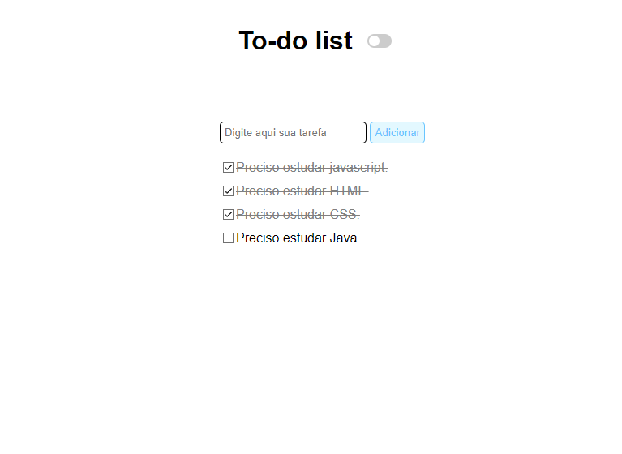
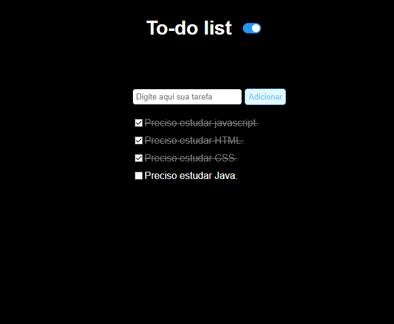

# To-do-list with DarkMode

Um projeto que eu fiz no Bootcamp Dev Fullstack Santander. Se trata de uma pequena lista
de coisas para fazer utilizando HTML, CSS e JS puro.
Além disso, incluí uma pequena feature que não estava no projeto inicial, um dark-mode bem simples.

## Screenshots

